<h3><code>mahan@github ~ $ ./contributions.sh</code></h3>

  

<h3><code>mahan@github ~ $ whoami</code></h3>

  

 

<h3><code>mahan@github ~ $ cat contact.txt</code></h3>

 

<code>contrib-heatmap.svg</code> is refreshed automatically every day by <a href="./.github/workflows/update-profile-art.yml">a GitHub Action</a>. The profile artwork is generated locally from <a href="./scripts">scripts in this repository</a>.

